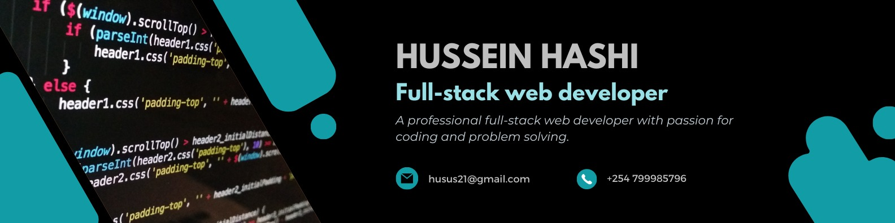

<h1 align="center">Hi 👋, I'm Hussein</h1>
<h2 align="center">Full-Stack Developer • Product Builder • Tech Problem Solver</h2>

  

---

### 🚀 About Me  
I'm a full-stack developer based in Nairobi, Kenya, specializing in building **production-grade SaaS platforms**, **business management systems**, **POS applications**, **real-estate platforms**, and **high-performance web apps**.

I focus on:
- Scalable backend architectures  
- Modern UI/UX with clean, premium aesthetics  
- Secure authentication systems  
- Payments, subscriptions & multi-tenant setups  
- Complex business logic (POS, inventory, accounting, CRM, real-estate, property management)

---

### 🔥 Current Tech Stack (Latest)

#### **Frontend**
- **Next.js 14+ (App Router)**
- **React**
- **TypeScript**
- **Tailwind CSS**
- **Shadcn/UI**
- Zustand / Redux Toolkit  
- Recharts, Framer Motion, React Hook Form, Zod  

#### **Backend**
- **Node.js + NestJS** (Modular architecture)
- **Prisma ORM**
- **PostgreSQL / MySQL**
- Redis (Caching, queues, sessions)
- JWT Auth, RBAC, Multi-tenant setups  
- Webhooks, background jobs, file uploads

#### **DevOps & Tools**
- Docker  
- Vercel, Railway, Render  
- GitHub Actions  
- Cloudinary / S3 Storage  

---

### 💳 Payment Integrations & Solutions
Experienced integrating:

- **Stripe** (Cards, subscriptions, billing)
- **PayPal** (Express & REST APIs)
- **M-Pesa (Daraja API)** for Kenya  
- **Flutterwave & Paystack** (Africa-wide)  
- Webhooks for real-time transactions  
- Multi-currency + multi-provider fallback logic  

---

### 🏗️ Recent Projects & Focus Areas
- Business Management System (POS + Inventory + CRM + Accounting)
- Real-estate listing platform w/ advanced filtering  
- Multi-tenant SaaS with custom subdomains (company.yourdomain.com)
- Property/Tenant management system  
- Content platforms & dashboard systems  
- Language-learning platform with video lessons  

---

### 🌐 Connect With Me

  
  
  

---

### 🛠️ Languages & Tools  

  
  
  
  
  
  
  
  
  
  

---

### 💡 Philosophy  
I build software that is:
- Scalable  
- Maintainable  
- Cleanly designed  
- Secure  
- Fast & user-focused  

If you're building a product, SaaS, or internal business system — let's connect.

---
